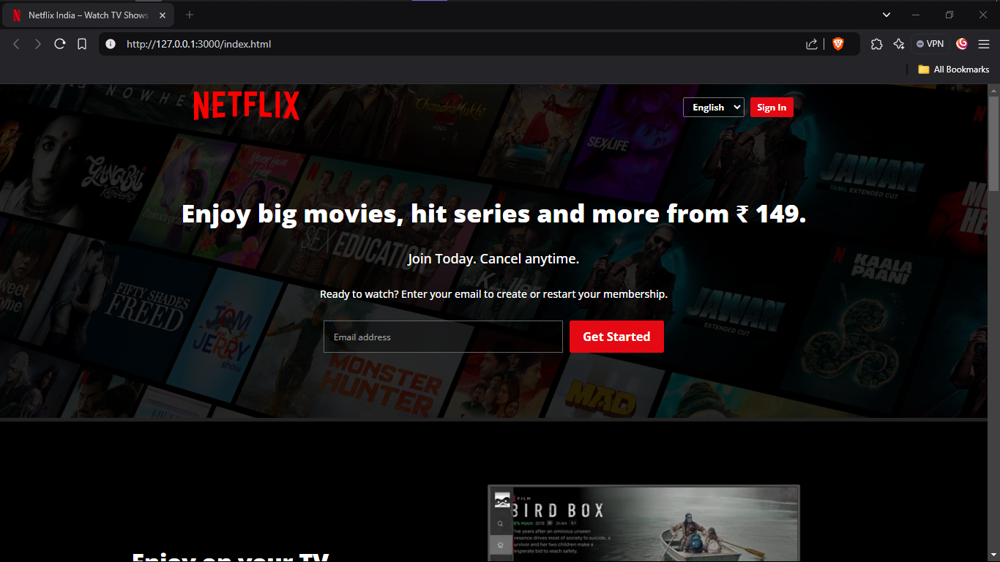

# Netflix-Welcome-Page-UI-Clone

This project is a recreation of Netflix's older welcome page UI, built with HTML and CSS.

The primary goal of this project was to practice front-end development skills, understand how real-world web layouts are designed, and learn the process of building a complete project.

Through this project, I gained insights into:

- Designing a professional-looking page.
- Implementing responsive designs for various devices.
- Understanding the workflow and thought process involved in web development.

## Features

- Responsive layout that adapts to different screen sizes.
- Styled components resembling the Netflix welcome page.
- Designed to improve skills in web design and layout.

## Tech Stack
- HTML5: For the structure.
- CSS3: For the styling and responsive design.

## What I Learned
- How to structure a web page with semantic HTML.
- Advanced CSS techniques like flexbox, grid, and responsive design.
- Replicating a real-world UI to better understand web layouts.

## Project Showcase


### Desktop Preview


### Mobile Preview
<div style = "text-align: center;"> 
    
</div>


## How to Use
- Clone this repository.
``` bash
git clone https://github.com/dipanshu447/Netflix-Welcome-Page-UI-Clone.git
```
- Open index.html in your browser.

## Note
This project is for educational and learning purposes only. It’s a static clone of Netflix’s older welcome page and is not associated with Netflix.

## Feedback
I’d love to hear your feedback! Feel free to reach out or suggest improvements.
